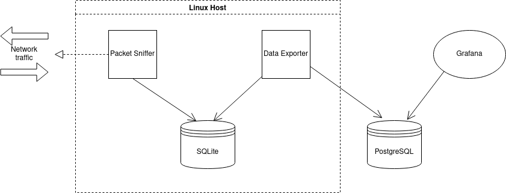

#Dokumentacja techniczna

##Schemat aplikacji

##Architektura
###Opis
Proces Packet Sniffer zajmuje się pobieraniem danych o ruchu sieciowym
bezpośrednio z pakietów, które są zapisywane do bazy SQLite.  
Proces Data Exporter zajmuje się pobraniem surowych informacji z bazy SQLite,
znalezieniem adresu DNS, wyliczeniem czasu trwania połączenia dla poszczególnych
hostów, oraz zaisania tych informacji w bazie PostgreSQL.  
Grafana jest narzędziem służącym do wizualizacji danych w postaci wykresów.
###Geneza
Początkowo architektura zakładała wykorzystanie jednego komponentu który 
zajmowałby się pobieraniem informacji o pakietach oraz udostępnianiem ich 
do wizualizacji. Powodem rozdzielenia na dwa komponenty (Packet Sniffer
 i Data Exporter) jest fakt, iż wydajne parsowanie ramek Ethernet wymaga 
ograniczenia innych czynności wykonywanych przez proces do minimum.  
Dodatkowo zrezygnowaliśmy 
##Opis komponentów
###Packet sniffer
Jest to program, którego celem jest parsowanie ramek Ethernet w celu 
znalezienia pakietów IP. Informacje z tych pakietów 
są zapisywane co 5 sekund w bazie SQLite w formacie:

- timestamp *datetime* - czas w którym pakiet został zparsowany 
- source *text* - adres IP źródła
- destination *text* - adres IP celu
- data *integer* - rozmiar pakietu w bajtach

###Data exporter
Jest to program, którego celem jest pobranie rekordów z bazy SQLite. 
Następnie proces dopasowywuje adres DNS za pomocą metody rDNS.
Kolejnym krokiem jest wyliczenie czasu trwania połączenia oraz przypisanie odpowienich
tagów. Ostatnim krokiem jest zapisanie rekordów do bazy PostgreSQL w postaci:
- timestamp *timestamp* - czas zapisania pakietu
- host1 *text NOT NULL* - adres IP źródła
- host2 *text NOT NULL* - adres IP celu
- host1_rdns *text* - adres DNS źródła
- host2_rdns *text* - adres DNS celu
- download *integer NOT NULL default 0* - rozmiar pobranych danych
- upload *integer NOT NULL default 0* - rozmiar wysłanych danych
- duration *double precision NOT NULL* - czas trwania połączenia
- tags *json* - tagi określające powiązane witryny, np. facebook

###Grafana
Grafana jest narzędziem wizualizującym dane pobrane bezpośrednio z bazy PostgreSQL.